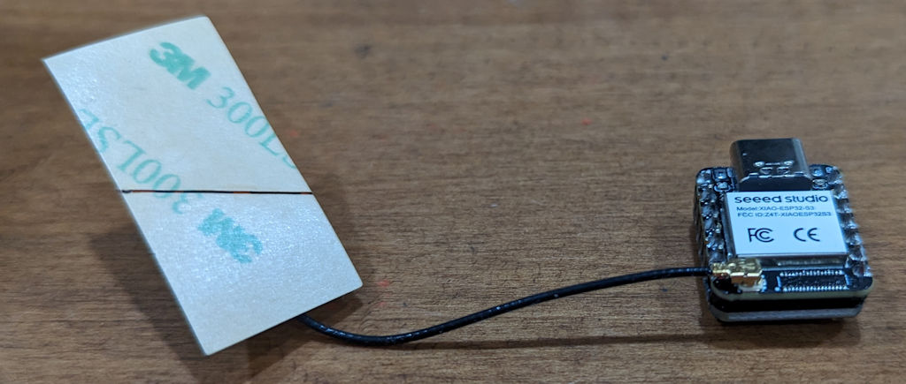

# Glowing Pumpkin Xiao 5x5 BFF Server

This is the [Glowing Pumpkin Xiao 5x5 BFF](https://github.com/johnwargo/glowing-pumpkin-xiao-bff) project with a web server added to you can control the app from a smartphone, tablet, of desktop PC. 

## Parts

For this project, I used:

* [Seeed Studio XIAO ESP32S3](https://www.seeedstudio.com/XIAO-ESP32S3-p-5627.html)
* [Adafruit 5x5 NeoPixel Grid BFF Add-On for QT Py and Xiao](https://www.adafruit.com/product/5646)

You should be able to use any of the Xiao boards, but I didn't test on anything but the one listed above; so the pinouts may vary.

The Adafruit 5x5 board comes pre-configured to connect to pin A3 on the Xiao, but supports other options as well. Refer to the Adafruit documentation for details.

## Assembly

Assembling the device is super easy, you can solder the device back to back (which is pretty cool) or you can use headers to connect them together. I used male headers to connect the two boards together as shown in the following figure.

It took me a while to figure out how to orient the two devices when connecting them together. When you put them together back to back, with the USB connector for the Xiao board pointing up, the 5x5 board should be facing up as well, with the text at the bottom and the power pads (`+` and `-` pads) at the top as shown in the following figure.

Attach the Wi-Fi antenna to the Xiao device as shown in the following figure:

## The Code

The code is pretty straight forward and installs like any other Arduino sketch. I'm not going to explain that here. 

You can find information on many different topics on my [personal blog](http://www.johnwargo.com). Learn about all of my publications at [John Wargo Books](http://www.johnwargobooks.com).

If you find this code useful and feel like thanking me for providing it, please consider <a href="https://www.buymeacoffee.com/johnwargo" target="_blank">Buying Me a Coffee</a>, or making a purchase from [my Amazon Wish List](https://amzn.com/w/1WI6AAUKPT5P9).
